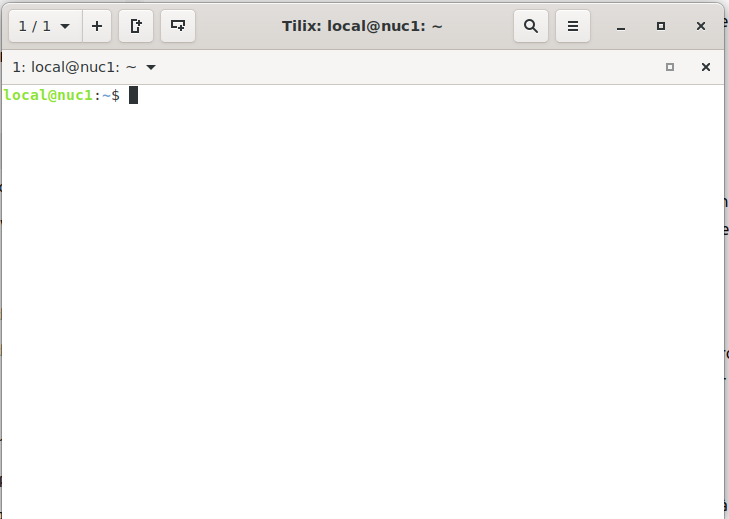
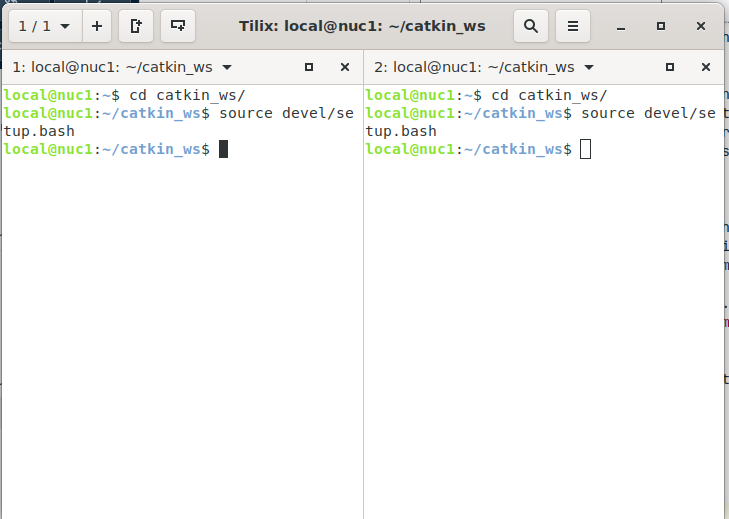
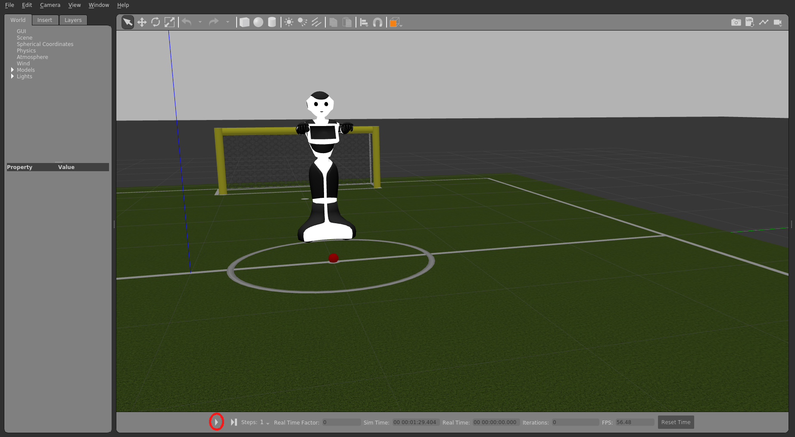
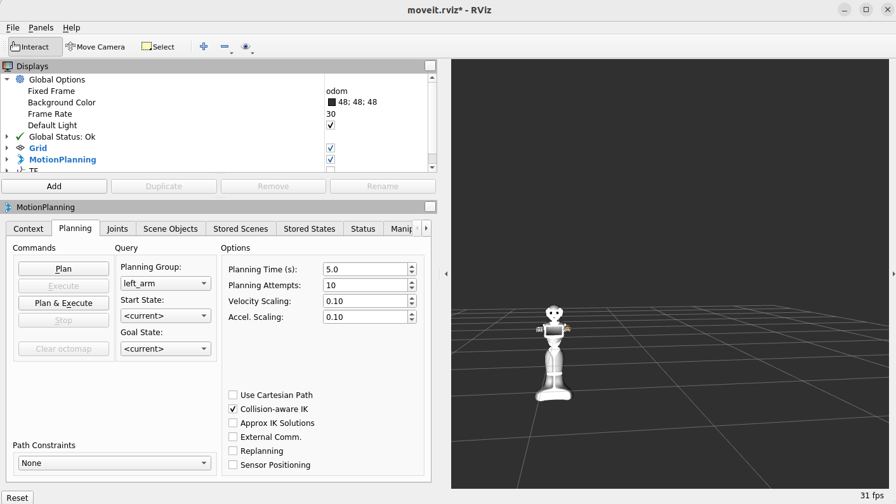
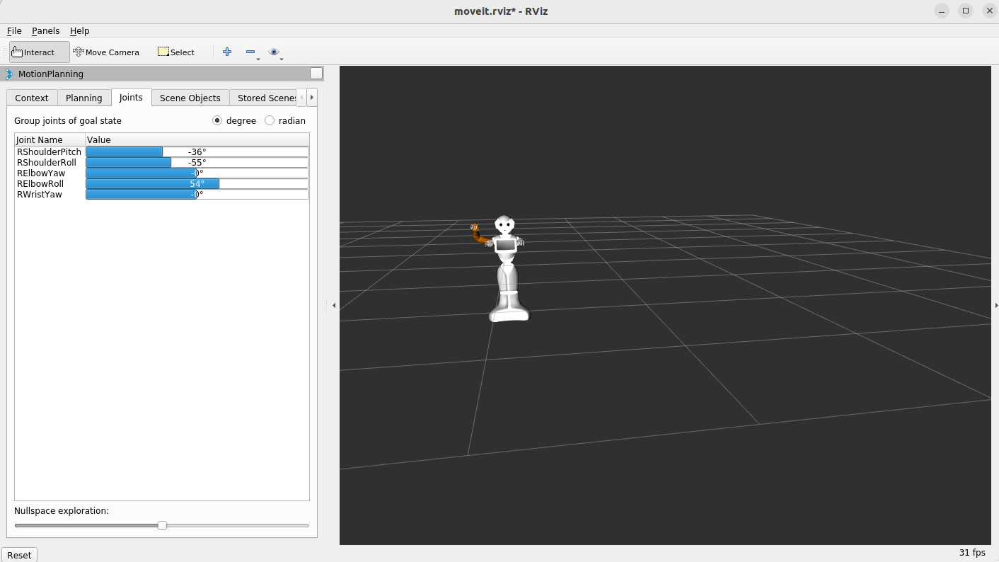

# PepperSimulation


## Getting started

To make it easy for you to get started with GitLab, here's a list of recommended next steps.

Already a pro? Just edit this README.md and make it your own. Want to make it easy? [Use the template at the bottom](#editing-this-readme)!

## Add your files

- [ ] [Create](https://docs.gitlab.com/ee/user/project/repository/web_editor.html#create-a-file) or [upload](https://docs.gitlab.com/ee/user/project/repository/web_editor.html#upload-a-file) files
- [ ] [Add files using the command line](https://docs.gitlab.com/ee/gitlab-basics/add-file.html#add-a-file-using-the-command-line) or push an existing Git repository with the following command:

```
cd existing_repo
git remote add origin https://gitlab-fi.ostfalia.de/hcr-lab/simulation/peppersimulation.git
git branch -M master
git push -uf origin master
```

## Integrate with your tools

- [ ] [Set up project integrations](https://gitlab-fi.ostfalia.de/hcr-lab/simulation/peppersimulation/-/settings/integrations)

## Collaborate with your team

- [ ] [Invite team members and collaborators](https://docs.gitlab.com/ee/user/project/members/)
- [ ] [Create a new merge request](https://docs.gitlab.com/ee/user/project/merge_requests/creating_merge_requests.html)
- [ ] [Automatically close issues from merge requests](https://docs.gitlab.com/ee/user/project/issues/managing_issues.html#closing-issues-automatically)
- [ ] [Enable merge request approvals](https://docs.gitlab.com/ee/user/project/merge_requests/approvals/)
- [ ] [Set auto-merge](https://docs.gitlab.com/ee/user/project/merge_requests/merge_when_pipeline_succeeds.html)

## Test and Deploy

Use the built-in continuous integration in GitLab.

- [ ] [Get started with GitLab CI/CD](https://docs.gitlab.com/ee/ci/quick_start/index.html)
- [ ] [Analyze your code for known vulnerabilities with Static Application Security Testing(SAST)](https://docs.gitlab.com/ee/user/application_security/sast/)
- [ ] [Deploy to Kubernetes, Amazon EC2, or Amazon ECS using Auto Deploy](https://docs.gitlab.com/ee/topics/autodevops/requirements.html)
- [ ] [Use pull-based deployments for improved Kubernetes management](https://docs.gitlab.com/ee/user/clusters/agent/)
- [ ] [Set up protected environments](https://docs.gitlab.com/ee/ci/environments/protected_environments.html)

***

# Editing this README

When you're ready to make this README your own, just edit this file and use the handy template below (or feel free to structure it however you want - this is just a starting point!). Thank you to [makeareadme.com](https://www.makeareadme.com/) for this template.

## Suggestions for a good README
Every project is different, so consider which of these sections apply to yours. The sections used in the template are suggestions for most open source projects. Also keep in mind that while a README can be too long and detailed, too long is better than too short. If you think your README is too long, consider utilizing another form of documentation rather than cutting out information.

## Name
Choose a self-explaining name for your project.

## Description
Let people know what your project can do specifically. Provide context and add a link to any reference visitors might be unfamiliar with. A list of Features or a Background subsection can also be added here. If there are alternatives to your project, this is a good place to list differentiating factors.

## Badges
On some READMEs, you may see small images that convey metadata, such as whether or not all the tests are passing for the project. You can use Shields to add some to your README. Many services also have instructions for adding a badge.

## Visuals
Depending on what you are making, it can be a good idea to include screenshots or even a video (you'll frequently see GIFs rather than actual videos). Tools like ttygif can help, but check out Asciinema for a more sophisticated method.

## Installation
Within a particular ecosystem, there may be a common way of installing things, such as using Yarn, NuGet, or Homebrew. However, consider the possibility that whoever is reading your README is a novice and would like more guidance. Listing specific steps helps remove ambiguity and gets people to using your project as quickly as possible. If it only runs in a specific context like a particular programming language version or operating system or has dependencies that have to be installed manually, also add a Requirements subsection.

## Usage
Use examples liberally, and show the expected output if you can. It's helpful to have inline the smallest example of usage that you can demonstrate, while providing links to more sophisticated examples if they are too long to reasonably include in the README.

## Support
Tell people where they can go to for help. It can be any combination of an issue tracker, a chat room, an email address, etc.

## Roadmap
If you have ideas for releases in the future, it is a good idea to list them in the README.

## Contributing
State if you are open to contributions and what your requirements are for accepting them.

For people who want to make changes to your project, it's helpful to have some documentation on how to get started. Perhaps there is a script that they should run or some environment variables that they need to set. Make these steps explicit. These instructions could also be useful to your future self.

You can also document commands to lint the code or run tests. These steps help to ensure high code quality and reduce the likelihood that the changes inadvertently break something. Having instructions for running tests is especially helpful if it requires external setup, such as starting a Selenium server for testing in a browser.

## Authors and acknowledgment
Show your appreciation to those who have contributed to the project.

## License
For open source projects, say how it is licensed.

## Project status
If you have run out of energy or time for your project, put a note at the top of the README saying that development has slowed down or stopped completely. Someone may choose to fork your project or volunteer to step in as a maintainer or owner, allowing your project to keep going. You can also make an explicit request for maintainers.

## How to run it ?
For this part we assume that you already ran it once and to all the setup that we talk about before.
So you have your docker image with the done setup.
```
docker run -it --rm \
    --name mon-conteneur-noetic \
    --privileged \
    --env="DISPLAY" \
    --volume="/tmp/.X11-unix:/tmp/.X11-unix:rw" \
    --volume="/dev/shm:/dev/shm" \
    --network=host \
    noetic_pepper

```
What is doing this line ?
It will run a container with the image you saved before (in my case noetic_pepper)
Now what is the purpose of each options ?

--rm will automatically remove the container once you stopped it so it will avoid name conflict.

--name mon-conteneur-noetic It's just the name of the container you can put whatever you want that is not already used.

--privileged give the docker user high status to avoid permissions issues

--env="DISPLAY" thanks to this the container will be able to use a GUI and we need that for the simulation

--volume="/tmp/.X11-unix:/tmp/.X11-unix:rw" mounts the host's X11 socket (/tmp/.X11-unix) into the container at the same location (/tmp/.X11-unix) with read and write permissions (rw). This allows GUI applications within the container to display their graphical interface on the host's screen.

--volume="/dev/shm:/dev/shm"
mounts the host's shared memory (/dev/shm) into the container at the same location (/dev/shm). This can improve performance for applications that use shared memory.

--network=host
uses the host's network mode for the container, meaning the container uses the host's network directly without network isolation. This may be necessary for certain use cases where the container needs to access the host's network.

noetic_pepper

Specifies the Docker image from which the container will be launched. In this case, the container will be based on the Docker image named noetic_pepper. It's my container on which I did all the installation.
Now you should have something like that.


Now split the terminal in two and tape thoses lines in both of them.
```
cd catkin_ws/
source devel/setup.bash 

```


Now in one of those terminal you will launch that command line.
```
roslaunch pepper_gazebo_plugin pepper_gazebo_plugin_Y20

```
It will open Gazebo and you will click on the start button at the bottom left of the screen (in red on the next sreenshot)


Once you have click on the start button go run that command in the second terminal.
```
roslaunch pepper_moveit_config moveit_planner.launch
```
(if you forget to launch the simulation before runningthis line Rviz will just not open)


So now you can plan any movment you want by choosing the planning group you want as well as the start state and the goal state.
But you can't choosean accurate trajectory here it's just random trajectory.
If you click on plan you will see a preview of the trajectory in Rviz.
If you click on Execute it will send the movment instruction to Gazebo and you will see the Gazebo Pepper robot move.
And if you click on Plan and execute you will have both the preview on Rviz and the movment on Gazebo.

If you want to set up Pepper in a particular position you have to go to the joints pane and you will have the joints correspondig at the planning group you chose before.

For example here the selected planning group is right arm so I can set several parameters to obtain the position I want.

I didn't try to do it but you can did the same on a real robot as explain in that tutorial that I use during this project: https://github.com/ros-naoqi/pepper_moveit_config
